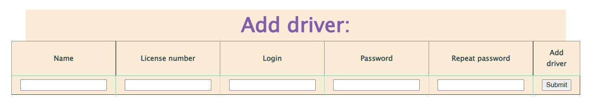
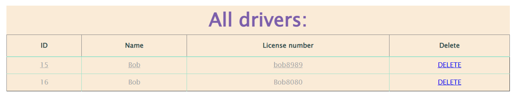
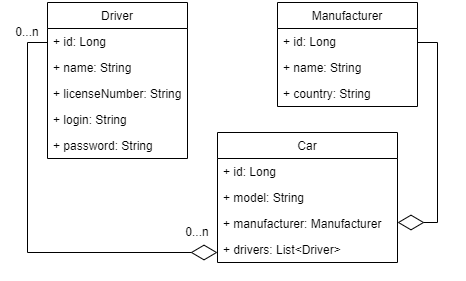

*<h1> 🚕Taxi Service🚕</h1>*

A simple web application for working with a taxi service. It supports authentication, registration and CRUD operation

<h2> 🙈Functionality </h2> 
<h3> Maine page</h3>

<h3> You can add driver</h3>

<h3> Get all drivers </h3>

<h2> 📚Project structure </h2>
<h3> Architecture </h3>

3-layer architecture + DB 

| Controller |
|:----------:|
|  Service   |
|    DAO     |

 DB structure

<h2> 📑Technology </h2>

| Technology	 | Version |
|:-----------:|:-------:|
|    JDK	     |   11    |
|   Maven	    |  4.0.0  |
|   TomCat	   | 9.0.68  |
|   MySQL	    | 8.0.30  |
|    JDBC	    |    -    |
|  Servlet	   |  4.0.1  |
|    JSTL	    |   1.2   |
|    JSP	     |    -    |
| HTML, CSS	  |    -    |

<h2> 🖱️How to use</h2>
<ol>
  <li>You must have JDK 11 or later</li>
  <li>Clone this project</li>
  <li>Create a schema using <a href="https://github.
com/SoulARC/taxi-service/blob/main/src/main/resources/init_db.sql#L9">script</a> </li>
  <li>Configure <a href="https://github.com/SoulARC/taxi-service/blob/main/src/main/java/taxi/util/ConnectionUtil.java#L9">ConnectionUtil.java</a> 
  <li>⏯Run</li>  
</ol> 

